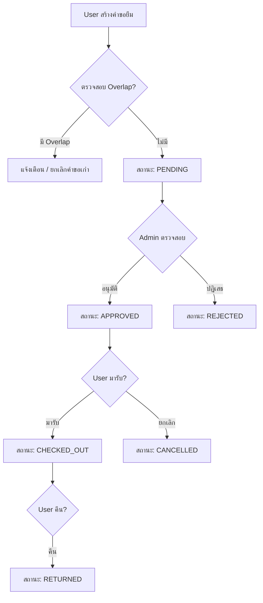

# 📚 Backend Documentation - Gear Rental System

เอกสารนี้อธิบายโครงสร้างและการทำงานของ Backend ทั้งหมดอย่างละเอียด

---

## 📋 สารบัญ

1. [ภาพรวมของระบบ](#1-ภาพรวมของระบบ)
2. [Technology Stack](#2-technology-stack)
3. [โครงสร้างโปรเจค](#3-โครงสร้างโปรเจค)
4. [Database Entities](#4-database-entities)
5. [Modules](#5-modules)
6. [API Endpoints](#6-api-endpoints)
7. [Enums และ Constants](#7-enums-และ-constants)
8. [Validation และ DTOs](#8-validation-และ-dtos)
9. [Middleware และ Filters](#9-middleware-และ-filters)
10. [Database Seeds](#10-database-seeds)

---

## 1. ภาพรวมของระบบ

Gear Rental System เป็นระบบยืม-คืนอุปกรณ์ที่พัฒนาด้วย **NestJS** Framework โดยใช้ **PostgreSQL** เป็นฐานข้อมูล และ **TypeORM** สำหรับจัดการ ORM

### หน้าที่หลักของระบบ:
- **จัดการอุปกรณ์ (Equipment Management)**: เพิ่ม ลบ แก้ไข อุปกรณ์ และจัดการ Stock
- **จัดการการยืม (Rental Management)**: สร้างคำขอยืม อนุมัติ/ปฏิเสธ เช็คเอาท์ และคืนอุปกรณ์
- **จัดการผู้ใช้ (User Management)**: ระบบ User และ Admin
- **บันทึก Audit Logs**: เก็บประวัติการทำรายการทั้งหมด

---

## 2. Technology Stack

| เทคโนโลยี | เวอร์ชัน | คำอธิบาย |
|-----------|----------|----------|
| NestJS | ^11.0.0 | Backend Framework หลัก |
| TypeORM | ^0.3.28 | Object-Relational Mapping |
| PostgreSQL | - | ฐานข้อมูลหลัก |
| Passport | ^0.7.0 | Authentication Middleware |
| JWT | ^11.0.2 | JSON Web Token สำหรับ Auth |
| Swagger | ^11.2.3 | API Documentation |
| class-validator | ^0.14.1 | Validation สำหรับ DTOs |
| bcrypt | ^6.0.0 | Password Hashing |
| Multer | (เป็น dependency ของ Express) | File Upload |

### Scripts ที่สำคัญ:
```bash
npm run start:dev   # รัน Development Server (Hot Reload)
npm run build       # Build Production
npm run seed        # รัน Database Seeding
npm run reset:seed  # Reset และ Seed ใหม่
```

---

## 3. โครงสร้างโปรเจค

```
backend/
├── src/
│   ├── app.module.ts          # Root Module
│   ├── app.controller.ts      # Root Controller
│   ├── main.ts                # Application Entry Point
│   │
│   ├── common/                # Shared Utilities
│   │   ├── enums/             # Enum Definitions
│   │   ├── filters/           # Exception Filters
│   │   └── middleware/        # Custom Middleware
│   │
│   ├── config/                # Configuration
│   │   └── env.validation.ts  # Environment Validation
│   │
│   ├── database/              # Database Related
│   │   └── seeds/             # Database Seeding
│   │
│   ├── auth/                  # Authentication Module
│   ├── users/                 # Users Module
│   ├── equipments/            # Equipments Module
│   ├── rentals/               # Rentals Module
│   └── audit-logs/            # Audit Logs Module
│
├── uploads/                   # Uploaded Images
├── .env                       # Environment Variables
└── package.json
```

---

## 4. Database Entities

### 4.1 User Entity

ตาราง `users` - เก็บข้อมูลผู้ใช้งานระบบ

```typescript
@Entity('users')
export class User {
    @PrimaryGeneratedColumn('uuid')
    id: string;                    // UUID ของ User

    @Column({ unique: true, nullable: true })
    studentId: string;             // รหัสนักศึกษา (ใช้สำหรับ Login)

    @Column()
    password: string;              // รหัสผ่าน (Hashed ด้วย bcrypt)

    @Column({ nullable: true })
    name: string;                  // ชื่อผู้ใช้

    @Column({ type: 'enum', enum: UserRole, default: UserRole.USER })
    role: UserRole;                // บทบาท: ADMIN หรือ USER

    @CreateDateColumn()
    createdAt: Date;               // วันที่สร้าง

    @UpdateDateColumn()
    updatedAt: Date;               // วันที่อัพเดทล่าสุด
}
```

---

### 4.2 Equipment Entity

ตาราง `equipments` - เก็บข้อมูลอุปกรณ์หลัก

```typescript
@Entity('equipments')
export class Equipment {
    @PrimaryGeneratedColumn('uuid')
    id: string;                    // UUID ของอุปกรณ์

    @Column()
    name: string;                  // ชื่ออุปกรณ์

    @Column({ nullable: true })
    category: string;              // หมวดหมู่

    @Column({ type: 'enum', enum: EquipmentStatus, default: EquipmentStatus.AVAILABLE })
    status: EquipmentStatus;       // สถานะ: AVAILABLE, MAINTENANCE, UNAVAILABLE

    @Column({ default: 1 })
    stockQty: number;              // จำนวนคงเหลือ

    @Column({ nullable: true })
    imageUrl: string;              // URL รูปภาพ

    @OneToMany(() => EquipmentItem, (item) => item.equipment, { cascade: true, eager: true })
    items: EquipmentItem[];        // รายการ Item ทั้งหมด

    @CreateDateColumn()
    createdAt: Date;
}
```

---

### 4.3 EquipmentItem Entity

ตาราง `equipment_items` - เก็บข้อมูลอุปกรณ์แต่ละชิ้น (รายตัว)

```typescript
@Entity('equipment_items')
export class EquipmentItem {
    @PrimaryGeneratedColumn('uuid')
    id: string;                    // UUID ของ Item

    @Column()
    equipmentId: string;           // FK ไปยัง Equipment

    @ManyToOne(() => Equipment, (equipment) => equipment.items, { onDelete: 'CASCADE' })
    @JoinColumn({ name: 'equipmentId' })
    equipment: Equipment;          // Relation กับ Equipment

    @Column()
    itemCode: string;              // รหัสชิ้น เช่น "001", "002"

    @Column({ type: 'enum', enum: EquipmentItemStatus, default: EquipmentItemStatus.AVAILABLE })
    status: EquipmentItemStatus;   // สถานะ: AVAILABLE, UNAVAILABLE, RENTED

    @CreateDateColumn()
    createdAt: Date;
}
```

**ความสัมพันธ์ระหว่าง Equipment และ EquipmentItem:**
- Equipment 1 ตัว มีได้หลาย EquipmentItem (One-to-Many)
- เมื่อสร้าง Equipment จะสร้าง Items ตาม `stockQty` อัตโนมัติ
- เมื่อลบ Equipment จะลบ Items ทั้งหมดตามไปด้วย (CASCADE)

---

### 4.4 Rental Entity

ตาราง `rentals` - เก็บข้อมูลการยืม-คืน

```typescript
@Entity('rentals')
export class Rental {
    @PrimaryGeneratedColumn('uuid')
    id: string;

    // === ความสัมพันธ์กับ User ===
    @Column()
    userId: string;

    @ManyToOne(() => User)
    @JoinColumn({ name: 'userId' })
    user: User;

    // === ความสัมพันธ์กับ Equipment ===
    @Column()
    equipmentId: string;

    @ManyToOne(() => Equipment, { onDelete: 'CASCADE' })
    @JoinColumn({ name: 'equipmentId' })
    equipment: Equipment;

    // === ความสัมพันธ์กับ EquipmentItem (Optional) ===
    @Column({ nullable: true })
    equipmentItemId: string;

    @ManyToOne(() => EquipmentItem, { nullable: true, onDelete: 'SET NULL' })
    @JoinColumn({ name: 'equipmentItemId' })
    equipmentItem: EquipmentItem;

    // === ช่วงเวลาการยืม ===
    @Column({ type: 'timestamp' })
    startDate: Date;                    // วันเริ่มยืม

    @Column({ type: 'timestamp' })
    endDate: Date;                      // วันสิ้นสุดการยืม

    // === สถานะและรายละเอียด ===
    @Column({ type: 'enum', enum: RentalStatus, default: RentalStatus.PENDING })
    status: RentalStatus;               // สถานะการยืม

    @Column({ type: 'text', nullable: true })
    requestDetails: string;             // รายละเอียดคำขอยืม

    @Column({ nullable: true })
    attachmentUrl: string;              // ไฟล์แนบ

    @Column({ type: 'text', nullable: true })
    rejectReason: string;               // เหตุผลที่ปฏิเสธ

    // === หลักฐานการเช็คเอาท์/คืน ===
    @Column({ nullable: true })
    checkoutImageUrl: string;           // รูปภาพตอนรับอุปกรณ์

    @Column({ type: 'text', nullable: true })
    checkoutNote: string;               // หมายเหตุตอนรับ

    @Column({ nullable: true })
    returnImageUrl: string;             // รูปภาพตอนคืน

    @Column({ type: 'text', nullable: true })
    returnNote: string;                 // หมายเหตุตอนคืน

    @Column({ type: 'text', nullable: true })
    cancelReason: string;               // เหตุผลที่ยกเลิก

    @CreateDateColumn()
    createdAt: Date;
}
```

---

### 4.5 AuditLog Entity

ตาราง `audit_logs` - เก็บประวัติการทำรายการทั้งหมด

```typescript
@Entity('audit_logs')
export class AuditLog {
    @PrimaryGeneratedColumn('uuid')
    id: string;

    @Column({ nullable: true })
    rentalId: string;              // FK ไปยัง Rental (ถ้ามี)

    @ManyToOne(() => Rental, { nullable: true, onDelete: 'SET NULL' })
    @JoinColumn({ name: 'rentalId' })
    rental: Rental;

    @Column()
    userId: string;                // ผู้ทำรายการ

    @ManyToOne(() => User)
    @JoinColumn({ name: 'userId' })
    user: User;

    @Column()
    username: string;              // ชื่อผู้ทำรายการ (เก็บซ้ำเพื่อความสะดวก)

    @Column()
    actionType: string;            // ประเภทการกระทำ เช่น RENTAL_CREATE, EQUIPMENT_UPDATE

    @Column({ type: 'text', nullable: true })
    details: string;               // รายละเอียดเพิ่มเติม (JSON)

    @CreateDateColumn()
    createdAt: Date;
}
```

---

## 5. Modules

### 5.1 App Module (Root)

`app.module.ts` เป็น Root Module ที่รวบรวม Module ทั้งหมด

**การตั้งค่าที่สำคัญ:**

```typescript
@Module({
    imports: [
        // 1. ConfigModule - โหลด Environment Variables
        ConfigModule.forRoot({
            isGlobal: true,
            validationSchema: envValidationSchema,
        }),

        // 2. ThrottlerModule - Rate Limiting (100 requests/60 วินาที)
        ThrottlerModule.forRoot([{ ttl: 60000, limit: 100 }]),

        // 3. TypeOrmModule - เชื่อมต่อ PostgreSQL
        TypeOrmModule.forRootAsync({
            useFactory: (configService: ConfigService) => ({
                type: 'postgres',
                host: configService.get('DB_HOST'),
                port: configService.get('DB_PORT'),
                username: configService.get('DB_USERNAME'),
                password: configService.get('DB_PASSWORD'),
                database: configService.get('DB_DATABASE'),
                entities: [User, Equipment, EquipmentItem, Rental, AuditLog],
                synchronize: true,  // Auto-sync schema (Dev only!)
            }),
        }),

        // 4. Feature Modules
        AuthModule,
        EquipmentsModule,
        RentalsModule,
        AuditLogsModule,
        SeedsModule,
    ],
})
```

---

### 5.2 Equipments Module

จัดการอุปกรณ์ทั้งหมด

#### EquipmentsService - Business Logic

| Method | คำอธิบาย |
|--------|----------|
| `create(dto, userId, username)` | สร้างอุปกรณ์ใหม่ พร้อมสร้าง Items ตาม stockQty อัตโนมัติ |
| `findAll()` | ดึงรายการอุปกรณ์ทั้งหมด เรียงตามวันสร้างล่าสุด |
| `findOne(id)` | ดึงอุปกรณ์ตาม ID พร้อม Items |
| `update(id, dto, userId, username)` | อัพเดทอุปกรณ์ และเพิ่ม Items ถ้า stockQty เพิ่มขึ้น |
| `updateItemStatus(itemId, status, userId, username)` | อัพเดทสถานะ Item แต่ละชิ้น |
| `remove(id, userId, username)` | ลบอุปกรณ์ (พร้อม Items ทั้งหมด) |

**การสร้าง Equipment Items อัตโนมัติ:**
```typescript
// เมื่อสร้าง Equipment ใหม่ที่มี stockQty = 3
// จะสร้าง Items 3 ชิ้นโดยอัตโนมัติ:
// - Item Code: "001", "002", "003"
```

---

### 5.3 Rentals Module

จัดการการยืม-คืนอุปกรณ์

#### RentalsService - Main Service

| Method | คำอธิบาย |
|--------|----------|
| `create(userId, dto)` | สร้างคำขอยืมใหม่ พร้อมตรวจสอบ overlap |
| `findAll()` | ดึงรายการยืมทั้งหมด (Admin) |
| `findByUser(userId)` | ดึงรายการยืมของ User |
| `findActiveByEquipment(equipmentId)` | ดึงรายการยืมที่ active ของอุปกรณ์ |
| `findOne(id)` | ดึงรายละเอียดการยืม |
| `updateStatus(id, dto)` | อัพเดทสถานะการยืม |
| `uploadImage(id, imageType, imageUrl, note)` | อัพโหลดรูปเช็คเอาท์/คืน |
| `updateCancelReason(id, reason)` | อัพเดทเหตุผลการยกเลิก |

#### RentalValidationService - ตรวจสอบความถูกต้อง

| Method | คำอธิบาย |
|--------|----------|
| `checkOverlap(...)` | ตรวจสอบว่ามีการจองซ้ำซ้อนกันหรือไม่ |
| `checkOverlapExcludingUser(...)` | ตรวจสอบ overlap โดยไม่นับ User ปัจจุบัน |
| `validateStatusTransition(current, new)` | ตรวจสอบว่าเปลี่ยนสถานะได้ถูกต้องหรือไม่ |
| `getOverlappingRentals(...)` | ดึงรายการที่ overlap |

#### RentalStockService - จัดการ Stock

| Method | คำอธิบาย |
|--------|----------|
| `handleStockUpdate(rental, newStatus)` | อัพเดท stock ตามสถานะใหม่ |
| `handleCheckout(rental)` | ลด stockQty เมื่อ CHECKED_OUT |
| `handleReturn(rental)` | เพิ่ม stockQty เมื่อ RETURNED |

---

### 5.4 Users Module

จัดการผู้ใช้งาน

#### UsersService

| Method | คำอธิบาย |
|--------|----------|
| `create(dto)` | สร้าง User ใหม่ พร้อม Hash Password |
| `findOneByStudentId(studentId)` | ค้นหา User จาก Student ID |
| `findOneById(id)` | ค้นหา User จาก UUID |

**Password Hashing:**
```typescript
// ใช้ bcrypt ในการ Hash Password
const salt = await bcrypt.genSalt();
const hashedPassword = await bcrypt.hash(password, salt);
```

---

### 5.5 Audit Logs Module

บันทึกประวัติการทำรายการ

#### AuditLogsService

| Method | คำอธิบาย |
|--------|----------|
| `log(userId, username, actionType, rentalId, details)` | บันทึก Log |
| `findAll()` | ดึง Log ทั้งหมด |
| `findByRental(rentalId)` | ดึง Log ของ Rental นั้น |
| `findByUser(userId)` | ดึง Log ของ User นั้น |
| `deleteOlderThan(days)` | ลบ Log ที่เก่ากว่า N วัน |
| `deleteAll()` | ลบ Log ทั้งหมด |

**ประเภท Action Types:**
- `RENTAL_CREATE` - สร้างคำขอยืม
- `RENTAL_STATUS_APPROVED` - อนุมัติ
- `RENTAL_STATUS_REJECTED` - ปฏิเสธ
- `RENTAL_STATUS_CHECKED_OUT` - เช็คเอาท์
- `RENTAL_STATUS_RETURNED` - คืน
- `RENTAL_STATUS_CANCELLED` - ยกเลิก
- `RENTAL_AUTO_CANCELLED` - ยกเลิกอัตโนมัติ (ส่งคำขอใหม่)
- `RENTAL_AUTO_REJECTED` - ปฏิเสธอัตโนมัติ (มีคนอื่นได้รับอนุมัติ)
- `EQUIPMENT_CREATE` - สร้างอุปกรณ์
- `EQUIPMENT_UPDATE` - อัพเดทอุปกรณ์
- `EQUIPMENT_DELETE` - ลบอุปกรณ์
- `EQUIPMENT_ITEM_STATUS_UPDATE` - อัพเดทสถานะ Item

---

## 6. API Endpoints

### 6.1 Equipments API

| Method | Endpoint | คำอธิบาย | Auth |
|--------|----------|----------|------|
| GET | `/api/equipments` | ดึงอุปกรณ์ทั้งหมด | Public |
| GET | `/api/equipments/:id` | ดึงอุปกรณ์ตาม ID | Public |
| GET | `/api/equipments/images/:filename` | ดึงรูปภาพอุปกรณ์ | Public |
| POST | `/api/equipments` | สร้างอุปกรณ์ | Admin |
| POST | `/api/equipments/:id/upload-image` | อัพโหลดรูปอุปกรณ์ | Admin |
| PATCH | `/api/equipments/:id` | อัพเดทอุปกรณ์ | Admin |
| PATCH | `/api/equipments/items/:itemId/status` | อัพเดทสถานะ Item | Admin |
| DELETE | `/api/equipments/:id` | ลบอุปกรณ์ | Admin |

---

### 6.2 Rentals API

| Method | Endpoint | คำอธิบาย | Auth |
|--------|----------|----------|------|
| POST | `/api/rentals` | สร้างคำขอยืม | User |
| POST | `/api/rentals/check-overlap` | ตรวจสอบ overlap | User |
| GET | `/api/rentals` | ดึงรายการยืมทั้งหมด | Admin |
| GET | `/api/rentals/me` | ดึงรายการยืมของตัวเอง | User |
| GET | `/api/rentals/equipment/:equipmentId/active` | ดึงรายการ active ของอุปกรณ์ | User |
| GET | `/api/rentals/:id` | ดึงรายละเอียดการยืม | User |
| PATCH | `/api/rentals/:id/status` | อัพเดทสถานะ | User |
| POST | `/api/rentals/:id/upload-image` | อัพโหลดรูปเช็คเอาท์/คืน | User |

---

### 6.3 Audit Logs API

| Method | Endpoint | คำอธิบาย | Auth |
|--------|----------|----------|------|
| GET | `/api/audit-logs` | ดึง Log ทั้งหมด | Admin |
| GET | `/api/audit-logs/rental/:rentalId` | ดึง Log ของ Rental | Admin |
| GET | `/api/audit-logs/user/:userId` | ดึง Log ของ User | Admin |

---

## 7. Enums และ Constants

### UserRole
```typescript
export enum UserRole {
    ADMIN = 'ADMIN',   // ผู้ดูแลระบบ
    USER = 'USER',     // ผู้ใช้งานทั่วไป
}
```

### RentalStatus
```typescript
export enum RentalStatus {
    PENDING = 'PENDING',           // รอการอนุมัติ
    APPROVED = 'APPROVED',         // อนุมัติแล้ว
    CHECKED_OUT = 'CHECKED_OUT',   // รับอุปกรณ์แล้ว
    RETURNED = 'RETURNED',         // คืนแล้ว
    REJECTED = 'REJECTED',         // ถูกปฏิเสธ
    CANCELLED = 'CANCELLED',       // ยกเลิก
}
```

### Status Transition Rules
```
PENDING → APPROVED, REJECTED, CANCELLED
APPROVED → CHECKED_OUT, CANCELLED
CHECKED_OUT → RETURNED
RETURNED → (สิ้นสุด)
REJECTED → (สิ้นสุด)
CANCELLED → (สิ้นสุด)
```

### EquipmentStatus
```typescript
export enum EquipmentStatus {
    AVAILABLE = 'AVAILABLE',       // พร้อมใช้งาน
    MAINTENANCE = 'MAINTENANCE',   // กำลังซ่อมบำรุง
    UNAVAILABLE = 'UNAVAILABLE',   // ไม่พร้อมใช้งาน (หมด stock)
}
```

### EquipmentItemStatus
```typescript
export enum EquipmentItemStatus {
    AVAILABLE = 'AVAILABLE',       // พร้อมใช้งาน
    UNAVAILABLE = 'UNAVAILABLE',   // ไม่พร้อมใช้งาน
    RENTED = 'RENTED',             // ถูกยืมอยู่
}
```

---

## 8. Validation และ DTOs

### การตั้งค่า Global Validation (main.ts)

```typescript
app.useGlobalPipes(
    new ValidationPipe({
        whitelist: true,           // ตัด properties ที่ไม่อยู่ใน DTO
        forbidNonWhitelisted: true, // Error ถ้ามี properties แปลกปลอม
        transform: true,           // แปลง type อัตโนมัติ
    }),
);
```

### ตัวอย่าง DTOs

**CreateEquipmentDto:**
- `name: string` (required)
- `category?: string` (optional)
- `stockQty?: number` (default: 1)
- `imageUrl?: string` (optional)

**CreateRentalDto:**
- `equipmentId: string` (required, UUID)
- `equipmentItemId?: string` (optional, UUID)
- `startDate: Date` (required)
- `endDate: Date` (required)
- `requestDetails?: string` (optional)
- `attachmentUrl?: string` (optional)
- `allowOverlap?: boolean` (optional, อนุญาตให้จองซ้ำซ้อนได้)

**UpdateRentalStatusDto:**
- `status: RentalStatus` (required)
- `rejectReason?: string` (optional, ใช้เมื่อ reject)
- `cancelReason?: string` (optional, ใช้เมื่อ cancel)

---

## 9. Middleware และ Filters

### LoggerMiddleware

บันทึก Log ทุก Request ที่เข้ามา

```typescript
export class LoggerMiddleware implements NestMiddleware {
    use(req: Request, res: Response, next: NextFunction) {
        console.log(`[${new Date().toISOString()}] ${req.method} ${req.url}`);
        next();
    }
}
```

### HttpExceptionFilter

จัดการ Exception และส่ง Response ในรูปแบบที่เหมือนกัน

```typescript
@Catch(HttpException)
export class HttpExceptionFilter implements ExceptionFilter {
    catch(exception: HttpException, host: ArgumentsHost) {
        // จัดรูปแบบ Error Response
    }
}
```

---

## 10. Database Seeds

### ไฟล์ที่เกี่ยวข้อง

- `src/database/seeds/seeds.module.ts` - Module สำหรับ Seeding
- `src/database/seeds/seed.js` - Script สำหรับ Seed ข้อมูล
- `src/database/seeds/reset-seed.js` - Script สำหรับ Reset และ Seed ใหม่

### วิธีใช้งาน

```bash
# Seed ข้อมูลเริ่มต้น
npm run seed

# Reset ฐานข้อมูลและ Seed ใหม่
npm run reset:seed
```

---

## 📌 สรุป Flow หลักของระบบ

### Flow การยืมอุปกรณ์ (Rental Flow)



### Flow การจัดการ Stock

```
เมื่อ CHECKED_OUT:
  1. ลด stockQty ของ Equipment
  2. เปลี่ยนสถานะ EquipmentItem เป็น RENTED
  3. ถ้า stockQty = 0 → Equipment.status = UNAVAILABLE

เมื่อ RETURNED:
  1. เพิ่ม stockQty ของ Equipment
  2. เปลี่ยนสถานะ EquipmentItem เป็น AVAILABLE
  3. ถ้า stockQty > 0 และ status = UNAVAILABLE → status = AVAILABLE
```

---

## 📖 Swagger API Documentation

เข้าถึงได้ที่: `http://localhost:3000/docs`

Swagger จะแสดง API ทั้งหมดพร้อม:
- Request/Response schemas
- ตัวอย่าง parameters
- Authentication requirements

---

*เอกสารนี้สร้างเมื่อ: January 2026*
