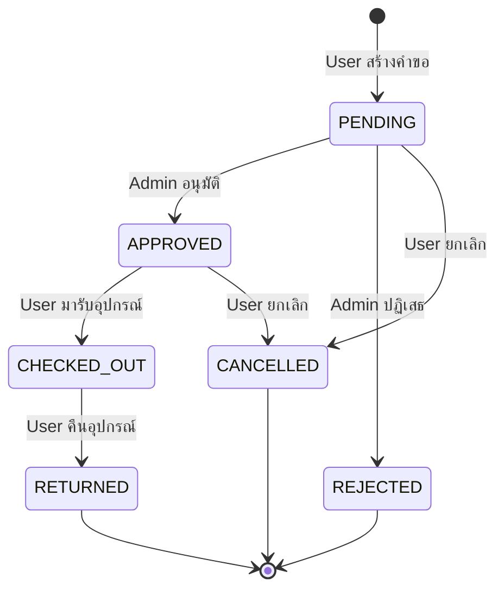

# 🧠 Business Logic & Project Highlights - Gear Rental System

เอกสารนี้อธิบาย **Business Logic** หลักของระบบอย่างเจาะลึก และเน้นจุดเด่นที่น่าสนใจของ Project

---

## 📋 สารบัญ

1. [ภาพรวม Business Logic](#1-ภาพรวม-business-logic)
2. [Rental Lifecycle Management](#2-rental-lifecycle-management)
3. [Overlap Detection & Resolution](#3-overlap-detection--resolution)
4. [Automatic Duplicate Request Handling](#4-automatic-duplicate-request-handling)
5. [Auto-Rejection System](#5-auto-rejection-system)
6. [Inventory & Stock Management](#6-inventory--stock-management)
7. [Equipment-Item Two-Level Architecture](#7-equipment-item-two-level-architecture)
8. [Comprehensive Audit Logging](#8-comprehensive-audit-logging)
9. [State Machine Pattern](#9-state-machine-pattern)
10. [Service Separation Pattern](#10-service-separation-pattern)
11. [Evidence-Based Rental Flow](#11-evidence-based-rental-flow)
12. [จุดเด่นและสิ่งที่น่าสนใจ](#12-จุดเด่นและสิ่งที่น่าสนใจ)

---

## 1. ภาพรวม Business Logic

ระบบ Gear Rental มี Business Logic หลักที่ซับซ้อนและครอบคลุม 3 ส่วนสำคัญ:

```
┌─────────────────────────────────────────────────────────────────┐
│                    GEAR RENTAL BUSINESS LOGIC                   │
├─────────────────────────────────────────────────────────────────┤
│                                                                 │
│  ┌─────────────────┐  ┌─────────────────┐  ┌─────────────────┐  │
│  │    RENTAL       │  │   INVENTORY     │  │    AUDIT        │  │
│  │   MANAGEMENT    │  │   MANAGEMENT    │  │   TRACKING      │  │
│  ├─────────────────┤  ├─────────────────┤  ├─────────────────┤  │
│  │ • Lifecycle     │  │ • Stock Qty     │  │ • All Actions   │  │
│  │ • Overlap       │  │ • Item Status   │  │ • Auto Events   │  │
│  │ • Auto-reject   │  │ • Auto-sync     │  │ • Traceability  │  │
│  │ • Duplicate     │  │ • 2-Level Model │  │ • Retention     │  │
│  └─────────────────┘  └─────────────────┘  └─────────────────┘  │
│                                                                 │
└─────────────────────────────────────────────────────────────────┘
```

---

## 2. Rental Lifecycle Management

### 2.1 Status Flow Diagram



### 2.2 Valid Status Transitions

| Current Status | Allowed Next Status |
|----------------|---------------------|
| `PENDING` | `APPROVED`, `REJECTED`, `CANCELLED` |
| `APPROVED` | `CHECKED_OUT`, `CANCELLED` |
| `CHECKED_OUT` | `RETURNED` |
| `RETURNED` | (Terminal State) |
| `REJECTED` | (Terminal State) |
| `CANCELLED` | (Terminal State) |

### 2.3 Implementation Code

```typescript
// rental-validation.service.ts
validateStatusTransition(currentStatus: RentalStatus, newStatus: RentalStatus): void {
    const allowedTransitions: Record<RentalStatus, RentalStatus[]> = {
        [RentalStatus.PENDING]: [RentalStatus.APPROVED, RentalStatus.REJECTED, RentalStatus.CANCELLED],
        [RentalStatus.APPROVED]: [RentalStatus.CHECKED_OUT, RentalStatus.CANCELLED],
        [RentalStatus.CHECKED_OUT]: [RentalStatus.RETURNED],
        [RentalStatus.RETURNED]: [],
        [RentalStatus.REJECTED]: [],
        [RentalStatus.CANCELLED]: [],
    };

    if (!allowedTransitions[currentStatus]?.includes(newStatus)) {
        throw new BadRequestException(
            `Cannot transition from ${currentStatus} to ${newStatus}`,
        );
    }
}
```

> **💡 จุดเด่น:** ใช้ Pattern **State Machine** เพื่อควบคุมการเปลี่ยนสถานะอย่างเข้มงวด ป้องกันการเปลี่ยนสถานะที่ไม่ถูกต้อง

---

## 3. Overlap Detection & Resolution

### 3.1 ปัญหาที่ต้องแก้

เมื่อมีอุปกรณ์จำนวนจำกัด ผู้ใช้หลายคนอาจขอยืมในช่วงเวลาที่ซ้อนทับกัน ระบบต้องตรวจจับและจัดการ

### 3.2 Overlap Detection Algorithm

```typescript
// ตรวจสอบว่ามีการจองซ้ำซ้อนหรือไม่
async checkOverlap(equipmentId, startDate, endDate, excludeRentalId?, equipmentItemId?): Promise<boolean> {
    const query = rentalRepository
        .createQueryBuilder('rental')
        .where('rental.equipmentId = :equipmentId', { equipmentId })
        // ไม่นับ Rental ที่สิ้นสุดแล้ว
        .andWhere('rental.status NOT IN (:...excludedStatuses)', {
            excludedStatuses: [RentalStatus.RETURNED, RentalStatus.REJECTED, RentalStatus.CANCELLED],
        })
        // เงื่อนไข Overlap: startDate < endDate AND endDate > startDate
        .andWhere('rental.startDate < :endDate', { endDate })
        .andWhere('rental.endDate > :startDate', { startDate });

    // ถ้าเจาะจง Item ให้ตรวจสอบเฉพาะ Item นั้น
    if (equipmentItemId) {
        query.andWhere('rental.equipmentItemId = :equipmentItemId', { equipmentItemId });
    }

    return (await query.getCount()) > 0;
}
```

### 3.3 หลักการตรวจสอบ Overlap

```
Overlap เกิดขึ้นเมื่อ: startDate1 < endDate2 AND endDate1 > startDate2

ตัวอย่าง:
Rental A: [10 ม.ค.] ============ [15 ม.ค.]
Rental B:         [12 ม.ค.] ============ [18 ม.ค.]
                        ↑ OVERLAP ↑

ไม่ Overlap:
Rental A: [10 ม.ค.] ============ [15 ม.ค.]
Rental B:                                   [16 ม.ค.] ============ [20 ม.ค.]
```

### 3.4 Allow Overlap Option

เพื่อความยืดหยุ่น ระบบรองรับ `allowOverlap` flag:

```typescript
// ถ้า allowOverlap = true จะข้ามการตรวจสอบ และอนุญาตให้ส่งคำขอได้
if (!allowOverlap) {
    const hasOverlap = await this.validationService.checkOverlapExcludingUser(...);
    if (hasOverlap) throw new BadRequestException('Equipment is already booked for this period');
}
```

> **💡 Use Case:** ให้ผู้ใช้ส่งคำขอได้แม้มีคนอื่นจองอยู่ (เพื่อเข้าคิว) และให้ Admin ตัดสินใจ

---

## 4. Automatic Duplicate Request Handling

### 4.1 ปัญหา

ผู้ใช้คนเดียวกันอาจส่งคำขอยืมอุปกรณ์เดียวกันในช่วงเวลาเดียวกันซ้ำหลายครั้ง ทำให้มี PENDING request ซ้ำซ้อน

### 4.2 Solution: Auto-Cancel Previous Requests

```typescript
private async handleDuplicateRequests(userId, equipmentId, start, end, equipmentItemId?) {
    // ค้นหา Pending requests ที่ซ้ำซ้อนของ User เดียวกัน
    const duplicates = await rentalRepository
        .createQueryBuilder('rental')
        .where('rental.userId = :userId', { userId })
        .andWhere('rental.equipmentId = :equipmentId', { equipmentId })
        .andWhere('rental.status = :status', { status: RentalStatus.PENDING })
        .andWhere('rental.startDate < :endDate', { endDate: end })
        .andWhere('rental.endDate > :startDate', { startDate: start })
        .getMany();

    // ยกเลิกคำขอเก่าทั้งหมด
    for (const dup of duplicates) {
        dup.status = RentalStatus.CANCELLED;
        await rentalRepository.save(dup);
        
        // บันทึก Audit Log
        await auditLogsService.log(
            userId, 'User', 'RENTAL_AUTO_CANCELLED', dup.id,
            JSON.stringify({ reason: 'Replaced by new request', newDates: { start, end } })
        );
    }
}
```

### 4.3 Flow Diagram

```
User ส่งคำขอใหม่ (อุปกรณ์ A, วันที่ 10-15)
         ↓
ตรวจสอบ: มี PENDING request ของ User ที่ซ้ำซ้อนหรือไม่?
         ↓
[พบ] → ยกเลิกคำขอเก่าอัตโนมัติ + บันทึก Log
         ↓
สร้างคำขอใหม่
```

> **💡 ประโยชน์:** ป้องกันการมี request ซ้ำซ้อนหลายรายการ และทำให้ User ไม่ต้องยกเลิกเอง

---

## 5. Auto-Rejection System

### 5.1 ปัญหา

เมื่อ Admin อนุมัติคำขอยืม 1 รายการ คำขอ PENDING อื่นที่ซ้อนทับควรถูกปฏิเสธอัตโนมัติ

### 5.2 Implementation

```typescript
private async handleAutoRejection(approvedRental: Rental): Promise<string[]> {
    // ค้นหา Rental ที่ซ้อนทับ
    const overlappingRentals = await validationService.getOverlappingRentals(
        approvedRental.equipmentId, 
        approvedRental.startDate, 
        approvedRental.endDate, 
        approvedRental.equipmentItemId
    );
    
    const rejectedNames: string[] = [];

    for (const other of overlappingRentals) {
        // ข้าม Rental ที่กำลังอนุมัติ และข้าม Rental ที่ไม่ใช่ PENDING
        if (other.id === approvedRental.id || other.status !== RentalStatus.PENDING) continue;

        // ปฏิเสธอัตโนมัติ
        other.status = RentalStatus.REJECTED;
        await rentalRepository.save(other);
        
        rejectedNames.push(`${other.user?.name} (${other.user?.studentId})`);

        await auditLogsService.log(
            other.userId, other.user?.name, 'RENTAL_AUTO_REJECTED', other.id,
            JSON.stringify({ 
                reason: 'Overlapping rental approved', 
                approvedRentalId: approvedRental.id 
            })
        );
    }
    
    return rejectedNames;  // ส่งกลับรายชื่อที่ถูก Reject
}
```

### 5.3 Flow Diagram

```
Admin อนุมัติ Rental A (อุปกรณ์ X, วันที่ 10-15)
                ↓
ค้นหา PENDING Rentals อื่นที่ซ้อนทับ
                ↓
     ┌──────────────────────────────┐
     │ Rental B (User2, 12-18)      │ → AUTO-REJECT
     │ Rental C (User3, 13-14)      │ → AUTO-REJECT
     │ Rental D (User4, 8-11)       │ → AUTO-REJECT
     └──────────────────────────────┘
                ↓
บันทึก Audit Log สำหรับทุกรายการ
                ↓
Response: { ...approvedRental, autoRejectedRentals: ["User2", "User3", "User4"] }
```

> **💡 ประโยชน์:** Admin ไม่ต้อง Reject ทีละรายการ ระบบทำให้อัตโนมัติ และ Response บอกให้ทราบว่ามีใครถูก Reject บ้าง

---

## 6. Inventory & Stock Management

### 6.1 Dual-Level Stock Tracking

ระบบติดตาม Stock 2 ระดับ:
1. **Equipment Level (stockQty):** จำนวนรวมที่พร้อมให้ยืม
2. **Item Level (status):** สถานะของแต่ละชิ้น

### 6.2 Stock Update Logic

```typescript
// rental-stock.service.ts
async handleStockUpdate(rental: Rental, newStatus: RentalStatus): Promise<void> {
    // เมื่อเปลี่ยนเป็น CHECKED_OUT
    if (newStatus === RentalStatus.CHECKED_OUT && rental.status !== RentalStatus.CHECKED_OUT) {
        await this.handleCheckout(rental);
    } 
    // เมื่อเปลี่ยนเป็น RETURNED
    else if (newStatus === RentalStatus.RETURNED && rental.status !== RentalStatus.RETURNED) {
        await this.handleReturn(rental);
    }
}
```

### 6.3 Checkout Flow

```typescript
private async handleCheckout(rental: Rental): Promise<void> {
    // 1. อัพเดท Item Status (ถ้ามี specific item)
    if (rental.equipmentItemId) {
        const item = await equipmentItemRepository.findOne({ where: { id: rental.equipmentItemId } });
        if (item) {
            item.status = EquipmentItemStatus.RENTED;
            await equipmentItemRepository.save(item);
        }
    }

    // 2. อัพเดท Equipment Stock
    const equipment = await equipmentRepository.findOne({ where: { id: rental.equipmentId } });
    if (equipment) {
        // ตรวจสอบว่ายังมี Stock
        if (equipment.stockQty <= 0) {
            throw new BadRequestException('Equipment is out of stock!');
        }
        
        // ลด Stock
        equipment.stockQty -= 1;
        
        // ถ้าหมด Stock ให้เปลี่ยนสถานะ Equipment
        if (equipment.stockQty === 0) {
            equipment.status = EquipmentStatus.UNAVAILABLE;
        }
        
        await equipmentRepository.save(equipment);
    }
}
```

### 6.4 Return Flow

```typescript
private async handleReturn(rental: Rental): Promise<void> {
    // 1. คืนสถานะ Item
    if (rental.equipmentItemId) {
        const item = await equipmentItemRepository.findOne({ where: { id: rental.equipmentItemId } });
        if (item) {
            item.status = EquipmentItemStatus.AVAILABLE;
            await equipmentItemRepository.save(item);
        }
    }

    // 2. เพิ่ม Stock กลับ
    const equipment = await equipmentRepository.findOne({ where: { id: rental.equipmentId } });
    if (equipment) {
        equipment.stockQty += 1;
        
        // ถ้ามี Stock แล้ว ให้กลับมา AVAILABLE
        if (equipment.stockQty > 0 && equipment.status === EquipmentStatus.UNAVAILABLE) {
            equipment.status = EquipmentStatus.AVAILABLE;
        }
        
        await equipmentRepository.save(equipment);
    }
}
```

### 6.5 Visual Flow

```
CHECKED_OUT:
┌─────────────────────────────────────────────────────────┐
│  Equipment (stockQty: 3)  →  Equipment (stockQty: 2)   │
│  Item #001 (AVAILABLE)    →  Item #001 (RENTED)        │
└─────────────────────────────────────────────────────────┘

RETURNED:
┌─────────────────────────────────────────────────────────┐
│  Equipment (stockQty: 2)  →  Equipment (stockQty: 3)   │
│  Item #001 (RENTED)       →  Item #001 (AVAILABLE)     │
└─────────────────────────────────────────────────────────┘
```

---

## 7. Equipment-Item Two-Level Architecture

### 7.1 Data Model

```
Equipment (อุปกรณ์ประเภท)
    │
    ├── EquipmentItem #001 (ชิ้นที่ 1)
    ├── EquipmentItem #002 (ชิ้นที่ 2)
    └── EquipmentItem #003 (ชิ้นที่ 3)
```

### 7.2 Auto-Create Items on Equipment Creation

```typescript
async create(createEquipmentDto: CreateEquipmentDto): Promise<Equipment> {
    const equipment = await equipmentRepository.save(
        equipmentRepository.create(createEquipmentDto)
    );

    // สร้าง Items อัตโนมัติตาม stockQty
    const stockQty = createEquipmentDto.stockQty || 1;
    const items: EquipmentItem[] = [];
    
    for (let i = 1; i <= stockQty; i++) {
        const item = equipmentItemRepository.create({
            equipmentId: equipment.id,
            itemCode: String(i).padStart(3, '0'),  // "001", "002", "003"
            status: EquipmentItemStatus.AVAILABLE,
        });
        items.push(item);
    }
    
    await equipmentItemRepository.save(items);
    return this.findOne(equipment.id);
}
```

### 7.3 Auto-Add Items When Increasing Stock

```typescript
async update(id: string, updateEquipmentDto: UpdateEquipmentDto): Promise<Equipment> {
    const equipment = await this.findOne(id);
    const oldStockQty = equipment.stockQty;
    const newStockQty = updateEquipmentDto.stockQty;

    // บันทึกข้อมูลอุปกรณ์
    Object.assign(equipment, updateEquipmentDto);
    await equipmentRepository.save(equipment);

    // ถ้า stockQty เพิ่มขึ้น → สร้าง Items เพิ่ม
    if (newStockQty && newStockQty > oldStockQty) {
        // หา itemCode สูงสุดปัจจุบัน
        const currentMaxCode = equipment.items.length > 0
            ? Math.max(...equipment.items.map(i => parseInt(i.itemCode)))
            : 0;
        
        // สร้าง Items ใหม่
        const itemsToAdd: EquipmentItem[] = [];
        for (let i = currentMaxCode + 1; i <= currentMaxCode + (newStockQty - oldStockQty); i++) {
            const item = equipmentItemRepository.create({
                equipmentId: equipment.id,
                itemCode: String(i).padStart(3, '0'),
                status: EquipmentItemStatus.AVAILABLE,
            });
            itemsToAdd.push(item);
        }
        await equipmentItemRepository.save(itemsToAdd);
    }
    
    return this.findOne(equipment.id);
}
```

> **💡 ประโยชน์:** Admin ไม่ต้องสร้าง Items เอง เพียงกำหนด stockQty ระบบจะจัดการให้

---

## 8. Comprehensive Audit Logging

### 8.1 Logging Strategy

ระบบบันทึกทุกการกระทำสำคัญ:

| Action Type | เมื่อไหร่ | Details |
|-------------|-----------|---------|
| `RENTAL_CREATE` | สร้างคำขอยืม | equipmentId, startDate, endDate |
| `RENTAL_STATUS_APPROVED` | อนุมัติ | previousStatus, newStatus |
| `RENTAL_STATUS_REJECTED` | ปฏิเสธ | previousStatus, newStatus |
| `RENTAL_STATUS_CHECKED_OUT` | รับอุปกรณ์ | previousStatus, newStatus |
| `RENTAL_STATUS_RETURNED` | คืน | previousStatus, newStatus |
| `RENTAL_AUTO_CANCELLED` | ถูกยกเลิกอัตโนมัติ | reason, newDates |
| `RENTAL_AUTO_REJECTED` | ถูกปฏิเสธอัตโนมัติ | reason, approvedRentalId |
| `EQUIPMENT_CREATE` | สร้างอุปกรณ์ | equipmentId, name, itemsCreated |
| `EQUIPMENT_UPDATE` | อัพเดทอุปกรณ์ | equipmentId, changes |
| `EQUIPMENT_DELETE` | ลบอุปกรณ์ | equipmentId, name |
| `EQUIPMENT_ITEM_STATUS_UPDATE` | เปลี่ยนสถานะ Item | itemId, itemCode, newStatus |

### 8.2 Log Retention Management

```typescript
// ลบ Log ที่เก่ากว่า N วัน
async deleteOlderThan(days: number): Promise<number> {
    const cutoffDate = new Date();
    cutoffDate.setDate(cutoffDate.getDate() - days);

    const result = await auditLogRepository
        .createQueryBuilder()
        .delete()
        .where('createdAt < :cutoffDate', { cutoffDate })
        .execute();

    return result.affected || 0;  // จำนวนที่ลบ
}
```

> **💡 ประโยชน์:** สามารถติดตามได้ว่าใครทำอะไร เมื่อไหร่ เพื่อ Accountability และ Debugging

---

## 9. State Machine Pattern

### 9.1 Implementation

ระบบใช้ **State Machine Pattern** สำหรับจัดการ Rental Status:

```typescript
// Strict status transition control
const allowedTransitions: Record<RentalStatus, RentalStatus[]> = {
    [RentalStatus.PENDING]:      [APPROVED, REJECTED, CANCELLED],
    [RentalStatus.APPROVED]:     [CHECKED_OUT, CANCELLED],
    [RentalStatus.CHECKED_OUT]:  [RETURNED],
    [RentalStatus.RETURNED]:     [],  // Terminal
    [RentalStatus.REJECTED]:     [],  // Terminal
    [RentalStatus.CANCELLED]:    [],  // Terminal
};
```

### 9.2 Benefits

- ✅ **Predictable:** การเปลี่ยนสถานะคาดเดาได้
- ✅ **Safe:** ป้องกันการเปลี่ยนสถานะที่ไม่ถูกต้อง
- ✅ **Auditable:** ทุกการเปลี่ยนสถานะถูกบันทึก
- ✅ **Maintainable:** กฎเปลี่ยนสถานะอยู่ที่เดียว

---

## 10. Service Separation Pattern

### 10.1 Single Responsibility Principle

Rentals Module แบ่ง Service ตามหน้าที่ชัดเจน:

```
rentals/
├── rentals.service.ts              # Main business logic, orchestration
├── rental-validation.service.ts    # Validation, overlap checking
└── rental-stock.service.ts         # Stock/inventory management
```

### 10.2 Benefits

| Pattern | ประโยชน์ |
|---------|----------|
| **Separation of Concerns** | แต่ละ Service มีหน้าที่เดียว |
| **Testability** | Test แต่ละส่วนแยกกันได้ |
| **Maintainability** | แก้ไขส่วนหนึ่งไม่กระทบส่วนอื่น |
| **Reusability** | ใช้ ValidationService หรือ StockService ที่อื่นได้ |

---

## 11. Evidence-Based Rental Flow

### 11.1 Image Upload for Checkout/Return

ระบบรองรับการอัพโหลดรูปภาพเป็นหลักฐาน:

```typescript
async uploadImage(
    id: string, 
    imageType: 'checkout' | 'return', 
    imageUrl: string, 
    note?: string
): Promise<Rental> {
    const rental = await this.findOne(id);
    
    if (imageType === 'checkout') {
        rental.checkoutImageUrl = imageUrl;
        if (note) rental.checkoutNote = note;
    } else {
        rental.returnImageUrl = imageUrl;
        if (note) rental.returnNote = note;
    }
    
    return rentalRepository.save(rental);
}
```

### 11.2 Rental Evidence Fields

```typescript
@Entity('rentals')
export class Rental {
    // ... other fields

    /** รูปถ่ายตอนรับอุปกรณ์ */
    @Column({ nullable: true })
    checkoutImageUrl: string;

    /** หมายเหตุตอนรับ */
    @Column({ type: 'text', nullable: true })
    checkoutNote: string;

    /** รูปถ่ายตอนคืน */
    @Column({ nullable: true })
    returnImageUrl: string;

    /** หมายเหตุตอนคืน */
    @Column({ type: 'text', nullable: true })
    returnNote: string;
}
```

> **💡 Use Case:** ลดข้อพิพาทเรื่องสภาพอุปกรณ์ ผู้ใช้ถ่ายรูปก่อนรับและหลังคืน

---

## 12. จุดเด่นและสิ่งที่น่าสนใจ

### 🌟 12.1 Intelligent Conflict Resolution

ระบบจัดการ Conflict อัตโนมัติ:
- **Duplicate Requests:** ยกเลิกคำขอเก่าอัตโนมัติ
- **Overlapping Approvals:** ปฏิเสธคำขอซ้อนทับอัตโนมัติ
- **Response Transparency:** บอกให้ Admin ทราบว่ามีใครถูก Auto-reject

### 🌟 12.2 Real-Time Stock Synchronization

Stock อัพเดทอัตโนมัติเมื่อ:
- สร้าง Equipment → สร้าง Items
- เพิ่ม Stock → สร้าง Items เพิ่ม
- Checkout → ลด Stock + เปลี่ยนสถานะ Item
- Return → เพิ่ม Stock + คืนสถานะ Item

### 🌟 12.3 Flexible Overlap Policy

ผู้ใช้เลือกได้ว่าจะ:
- **Strict Mode:** ไม่อนุญาตให้จองซ้ำซ้อน (`allowOverlap: false`)
- **Queue Mode:** ให้จองได้แม้ซ้อนทับ (`allowOverlap: true`) เพื่อเข้าคิว

### 🌟 12.4 Complete Traceability

ทุกการกระทำถูกบันทึกใน Audit Log:
- ใครทำ
- ทำอะไร
- เมื่อไหร่
- รายละเอียด (JSON)

### 🌟 12.5 Clean Architecture

- **Modular Design:** แบ่ง Module ตาม Feature
- **Service Separation:** แบ่ง Service ตามหน้าที่
- **DTO Validation:** ตรวจสอบ Input ด้วย class-validator
- **Consistent Error Handling:** ใช้ NestJS Exception Filter

### 🌟 12.6 Developer Experience

- **Swagger Documentation:** มี API Docs พร้อมใช้งาน
- **TypeScript:** Type-safe development
- **Hot Reload:** เปลี่ยนโค้ดเห็นผลทันที
- **Database Seeding:** มี Script สร้างข้อมูลทดสอบ

---

## 📊 Summary Diagram

```
┌───────────────────────────────────────────────────────────────────────────┐
│                        GEAR RENTAL SYSTEM HIGHLIGHTS                       │
├───────────────────────────────────────────────────────────────────────────┤
│                                                                           │
│  🎯 BUSINESS LOGIC                                                        │
│  ├─ State Machine for Rental Status                                      │
│  ├─ Overlap Detection Algorithm                                          │
│  ├─ Auto-Cancel Duplicate Requests                                       │
│  ├─ Auto-Reject Overlapping Requests                                     │
│  └─ Real-Time Stock Synchronization                                      │
│                                                                           │
│  🏗️ ARCHITECTURE                                                          │
│  ├─ Two-Level Equipment-Item Model                                       │
│  ├─ Service Separation (Validation, Stock, Core)                         │
│  ├─ Comprehensive Audit Logging                                          │
│  └─ Evidence-Based Rental Flow                                           │
│                                                                           │
│  ✨ DEVELOPER EXPERIENCE                                                  │
│  ├─ NestJS + TypeORM + PostgreSQL                                        │
│  ├─ Swagger API Documentation                                            │
│  ├─ TypeScript Type Safety                                               │
│  └─ Database Seeding Scripts                                             │
│                                                                           │
└───────────────────────────────────────────────────────────────────────────┘
```

---

*เอกสารนี้สร้างเมื่อ: January 2026*
